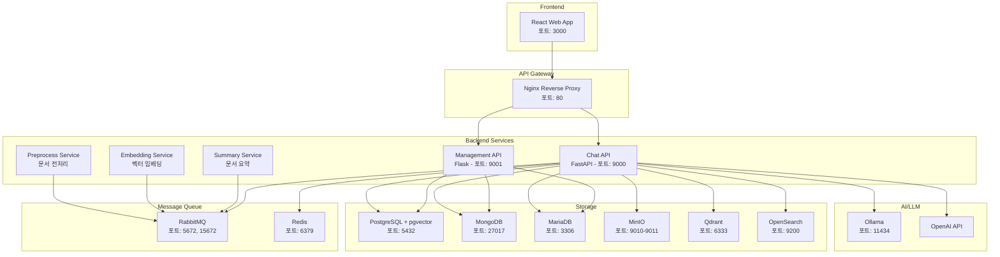

# OpenAry - 온프레미스 RAG 시스템

<div align="center">

**내 문서로 만드는 나만의 ChatGPT**

[](LICENSE)
[](https://www.docker.com/)
[](https://www.python.org/)
[](https://reactjs.org/)

</div>

## 📋 개요

**OpenAry**는 기업 또는 개인이 자신의 문서와 데이터를 활용한 AI 채팅 시스템을 구축할 수 있는 종합적인 온프레미스 RAG(Retrieval-Augmented Generation) 플랫폼입니다.

사용자가 업로드한 문서들을 기반으로 질문에 답변하는 지능형 QA 시스템으로, 완전한 데이터 보안과 프라이버시를 보장합니다.

## ✨ 주요 기능

### 🤖 **RAG 기반 지능형 QA**
- 업로드된 문서 기반 질의응답
- 하이브리드 검색 (벡터 + 키워드)
- 실시간 스트리밍 응답
- 다중 LLM 모델 지원 (OpenAI GPT, Ollama)

### 📄 **완전한 문서 처리 파이프라인**
- 자동 문서 전처리 (PDF, HWP, DOC 등)
- 텍스트 추출 및 청킹
- 벡터 임베딩 생성
- 자동 문서 요약

### 🔐 **보안 및 프라이버시**
- 온프레미스 배포로 데이터 보안 보장
- JWT 기반 사용자 인증
- 사용자별 데이터 격리
- 개인정보 외부 유출 없음

### 🎛️ **사용자 친화적 인터페이스**
- 직관적인 웹 기반 채팅 UI
- 파일 업로드 대시보드
- 채팅 세션 관리
- 음성 입력/출력 지원

## 🏗️ 시스템 아키텍처



## 🚀 빠른 시작

### 사전 요구사항

- **Docker** 및 **Docker Compose** 설치 필요
- **시스템 요구사항 (실제 사용량 기준):**
  - **RAM**: 
    - **최소**: 8GB (기본 운영용)
    - **권장**: 12GB 이상 (안정적 운영 + 여유분)
    - **실제 사용량**: 약 6GB (17개 컨테이너)
  - **Storage**: 
    - **최소**: 30GB 이상 여유 공간
    - **권장**: 50GB 이상 (문서 저장 + 로그 + 임베딩 데이터)
  - **CPU**: 
    - **최소**: 4 코어 이상
    - **권장**: 6 코어 이상 (AI 처리 작업 고려)
  - **네트워크**: 안정적인 인터넷 연결 (상용 LLM API 사용 시)

### 1. 프로젝트 클론

```bash
git clone https://github.com/theprismdata/Openary-onpremise.git
cd Openary-onpremise
```

### 2. 환경 설정

Docker 컴포즈 디렉토리로 이동:

```bash
cd OpenAry-RAG-Docker
```

### 3. Docker의 설정 파일 구성
`OpenAry-RAG-Docker/config/svc-set.yaml` 파일에서 다음 설정을 **반드시 수정**하세요:

```yaml
# ⚠️ 보안 중요: 다음 값들을 실제 값으로 변경하세요
langmodel:
  API:
    OpenAI:
      apikey: "실제-OpenAI-API-키-입력"
      
# 데이터베이스 비밀번호 변경
database:
  vector_db_postgres:
    pwd: "강력한-비밀번호-설정"
  opds_system_db:
    pwd: "강력한-비밀번호-설정"
  mongodb:
    mongo_passwd: "강력한-비밀번호-설정"

# JWT 시크릿 키 변경 (32바이트 이상 권장)
SECRET_KEY: "your-production-secret-key-32-bytes-or-more"
REFRESH_TOKEN_SECRET_KEY: "your-production-refresh-key-32-bytes-or-more"
```

### 4. 시스템 실행

#### Windows 환경:
```bash
# 시스템 설치 및 실행
setup-openary-local.bat

# 또는 수동 실행
docker-compose -f openary-local-compose.yaml up -d
```

#### Linux/macOS 환경:
```bash
# Docker Compose 실행
docker-compose -f openary-local-compose.yaml up -d
```

### 5. 시스템 상태 확인

#### Windows:
```bash
status-openary-local.bat
```

#### 수동 확인:
```bash
docker-compose -f openary-local-compose.yaml ps
```

### 6. 웹 접속

브라우저에서 접속:
- **메인 애플리케이션**: http://localhost
- **관리 대시보드**: http://localhost:15672 (RabbitMQ)
- **MinIO 콘솔**: http://localhost:9011
- **OpenSearch 대시보드**: http://localhost:5601

## 📖 사용법

### 1. 계정 생성

최초 접속 시 계정을 생성하거나 관리 API를 통해 사용자를 추가합니다.

### 2. 문서 업로드

1. 로그인 후 파일 업로드 대시보드 접속
2. 지원 파일 형식: PDF, DOC, DOCX, HWP, TXT 등
3. 파일 업로드 후 자동 처리 대기 (전처리 → 임베딩 → 인덱싱)

### 3. 채팅 시작

1. 채팅 인터페이스에서 질문 입력
2. 업로드된 문서 기반으로 답변 생성
3. 실시간 스트리밍으로 응답 확인

### 4. 고급 기능

- **음성 입력**: 마이크 버튼으로 음성 질문
- **음성 출력**: 답변을 음성으로 청취
- **세션 관리**: 이전 대화 기록 조회/삭제
- **파일 관리**: 업로드된 문서 관리

## 🛠️ 기술 스택

### Frontend
- **React 18**: 모던 웹 프레임워크
- **Redux Toolkit**: 상태 관리
- **Tailwind CSS**: 스타일링
- **Lucide Icons**: 아이콘 라이브러리

### Backend
- **FastAPI**: 고성능 REST API
- **Flask**: 관리 서비스
- **SQLAlchemy**: ORM
- **Pydantic**: 데이터 검증

### AI/ML
- **OpenAI GPT**: 클라우드 LLM
- **Ollama**: 로컬 LLM 서버
- **HuggingFace Transformers**: 임베딩 모델
- **LangChain**: LLM 통합 프레임워크

### 데이터베이스
- **PostgreSQL + pgvector**: 벡터 검색
- **Qdrant**: 전용 벡터 데이터베이스
- **OpenSearch**: 하이브리드 검색
- **MongoDB**: 문서 및 채팅 데이터
- **MariaDB**: 사용자 및 시스템 데이터
- **Redis**: 캐싱 및 세션

### 인프라
- **Docker & Docker Compose**: 컨테이너화
- **Nginx**: 리버스 프록시
- **RabbitMQ**: 메시지 큐
- **MinIO**: 객체 스토리지

## 🔧 시스템 관리

### 리소스 모니터링

#### 실시간 리소스 사용량 확인:
```bash
# 모든 컨테이너 리소스 사용량 확인
docker stats

# 특정 컨테이너만 모니터링
docker stats opensearch opds-chatapi opds-embedding

# 한 번만 조회 (실시간 아님)
docker stats --no-stream
```

#### 주요 리소스 사용 컨테이너 (참고):
- **opensearch**: ~1.5GB RAM (검색 엔진)
- **opds-chatapi**: ~1.9GB RAM (Chat API)
- **opds-embedding**: ~1.8GB RAM (임베딩 서비스)
- **전체 시스템**: 약 6GB RAM 사용 (17개 컨테이너)

#### 리소스 부족 시 대처방법:
```bash
# 메모리 사용량이 높은 컨테이너 확인
docker stats --format "table {{.Container}}\t{{.CPUPerc}}\t{{.MemUsage}}" --no-stream

# 특정 서비스 재시작 (메모리 정리)
docker-compose -f openary-local-compose.yaml restart opensearch
```

### 로그 확인

#### Windows:
```bash
logs-openary-local.bat
```

#### 수동:
```bash
docker-compose -f openary-local-compose.yaml logs -f [service-name]
```

### 시스템 중지

#### Windows:
```bash
stop-openary-local.bat
```

#### 수동:
```bash
docker-compose -f openary-local-compose.yaml down
```

### 시스템 정리

#### Windows:
```bash
cleanup-openary-local.bat
```

#### 수동:
```bash
docker-compose -f openary-local-compose.yaml down -v
docker system prune -a
```

## 🔍 트러블슈팅

### 일반적인 문제

1. **포트 충돌**: 다른 서비스가 동일한 포트를 사용하는 경우
   - `docker-compose.yaml`에서 포트 번호 수정

2. **메모리 부족**: 시스템 리소스 부족 (실제 6GB+ 사용)
   - **OpenSearch 메모리 부족 (가장 빈번)**:
     ```bash
     # OpenSearch 메모리 제한 증가 (docker-compose.yaml 수정)
     # deploy.resources.limits.memory: "4g" (기본 2g에서 증가)
     ```
   - **전체 시스템 메모리 부족**:
     - 시스템 RAM 12GB 이상 권장
     - 불필요한 서비스 중지
     - Docker Desktop 메모리 제한 증가

3. **OpenAI API 키 오류**: API 키가 없거나 잘못된 경우
   - Ollama 로컬 모델 사용으로 전환

4. **설정 파일 오류**: 기본 설정값 사용으로 인한 오류
   - `config/svc-set.yaml`에서 실제 값으로 변경 필요

### 로그 분석

각 서비스별 로그 위치:
- Chat API: `OpenAry-RAG-API-Server/opds_chat_rest/log/`
- Management: `OpenAry-RAG-API-Server/opds_mgmt/log/`
- Preprocessing: `OpenAry-RAG-API-Server/opds_preprocess/log/`

## 🔒 보안 권장사항

### 프로덕션 환경 배포 시

1. **설정 파일 보안**
   ```bash
   # 설정 파일 권한 제한
   chmod 600 config/svc-set.yaml
   ```

2. **API 키 관리**
   - 환경변수 또는 별도 시크릿 파일 사용
   - 정기적으로 API 키 교체

3. **데이터베이스 보안**
   - 기본 비밀번호 변경 필수
   - 네트워크 접근 제한 설정

4. **방화벽 설정**
   - 필요한 포트만 외부 접근 허용
   - 관리 인터페이스는 내부 네트워크만 접근

## 📄 라이선스

이 프로젝트는 [GPL v3 라이선스](LICENSE) 하에 배포됩니다.

## 👥 개발팀

| 역할 | 이름 | 이메일 |
|------|------|--------|
| 프론트엔드 | 이수경 | tnrud4685@gmail.com |
| RAG & 백엔드 | 신홍중 | theprismdata@gmail.com |
| CA | 김종표 | armyost1@gmail.com |
| 기획/설계 | 이재수 | ljs9643@gmail.com |

## 🤝 기여하기

1. Fork the Project
2. Create your Feature Branch (`git checkout -b feature/AmazingFeature`)
3. Commit your Changes (`git commit -m 'Add some AmazingFeature'`)
4. Push to the Branch (`git push origin feature/AmazingFeature`)
5. Open a Pull Request

## 📞 지원

문제가 있거나 도움이 필요한 경우:
- Issues 탭에서 버그 리포트 또는 기능 요청
- 개발팀 이메일로 직접 연락

---

<div align="center">

**OpenAry**로 더 스마트한 문서 관리를 시작하세요! 🚀

</div>